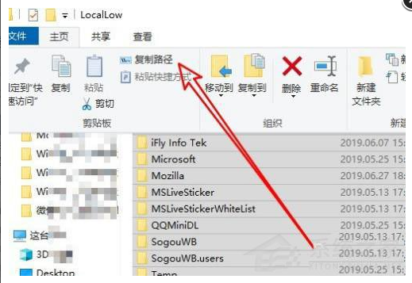
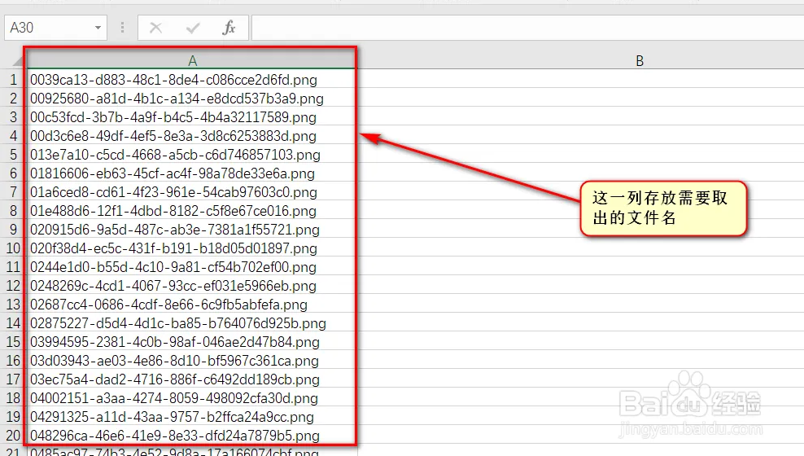

# Word 转 PDF

## 目录中显示：错误未定义书签

全选后按住ctrl+F11或者Ctrl+Shift+F9即可

Distribution Focal Loss的公式如下：

$$
\begin{aligned}
L_{DFL}(p_i, t_i) &= -\alpha_t (1 - p_i)^{\gamma_t} \log(p_i) \
&\quad\quad -\alpha_f p_i^{\gamma_f} \log(1 - p_i) \
&\quad\quad -\beta_t \log(\hat{p}_i) - \beta_f \log(1 - \hat{p}_i),
\end{aligned}
$$

其中，$p_i$表示预测框$i$中包含目标的概率，$t_i$表示$i$框的真实类别标签，$\alpha_t$和$\alpha_f$是正负样本的平衡参数，$\gamma_t$和$\gamma_f$是Focal Loss中的调节因子，$\hat{p}_i$表示预测框$i$中目标的分布概率密度函数，$\beta_t$和$\beta_f$是[Distribution Focal Loss]()中的调节因子。

具体来说，该损失函数中的第一项和第二项分别是Focal Loss中的正样本损失和负样本损失，用于加强对难分类样本的学习。而第三项和第四项是Distribution Focal Loss中的正样本损失和负样本损失，用于约束预测框中目标的分布概率密度函数，以更好地衡量目标检测中边界框的不确定性。

需要注意的是，以上公式中的各个参数需要根据具体的任务和数据集进行调节和优化。

# 批量复制指定文件

## 1.生成文件清单

点击主页工具栏上的复制路径图标

粘贴到空白文件中

## 批量复制

将已知的文件名复制到excel中第一列的位置

="copy D:\IMAGE\FAIL\"  & A1 & " D:\IMAGE\test"。其中“D:\IMAGE\FAIL\”与“D:\IMAGE\test”替换成自己对应的源文件路径名和目标路径

再复制一次粘贴为值

新建一个记事本复制copy...的内容

最后把“.txt”修改为“.bat”执行该文件
